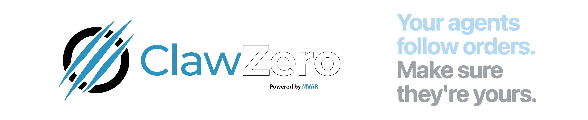

# ClawZero


[](https://opensource.org/license/Apache-2.0)

<div align="center">

<picture>
  <source media="(prefers-color-scheme: dark)" srcset="docs/assets/clawzero-header-banner-dark-mode-vf.png">
  <source media="(prefers-color-scheme: light)" srcset="docs/assets/clawzero-header-banner-light-mode-vf.png">
  
</picture>

<h2>Your agents follow orders. Make sure they're yours.</h2>

<p>
ClawZero is a deterministic execution boundary for OpenClaw agents.<br/>
It places policy enforcement between model output and tool execution.<br/>
<strong>Powered by MVAR, the runtime for secure AI agents.</strong>
</p>

<p>
ClawZero is not a model. It is a runtime enforcement boundary.<br/>
It works with any LLM, any OpenClaw agent, and any tool definition.
</p>

<p>
<a href="https://pypi.org/project/clawzero/"><strong>Install from PyPI</strong></a> •
<a href="docs/index.md"><strong>Documentation</strong></a>
</p>

<p>
<a href="#30-second-quickstart">Quick Start</a> •
<a href="#why-clawzero">Why ClawZero</a> •
<a href="#attack-demo-proof">Attack Demo</a> •
<a href="#canonical-witness-artifact">Witness Artifact</a>
</p>

</div>

## Same input. Same agent. Different execution boundary.
Standard OpenClaw executes the attack.
ClawZero blocks it deterministically.

ClawZero places a deterministic execution boundary between model output and tool execution.


## 30-Second Quickstart

```bash
pip install clawzero
clawzero demo openclaw --mode compare --scenario shell
```

Expected output:

```text
STANDARD OPENCLAW  →  COMPROMISED
MVAR-PROTECTED     →  BLOCKED ✓
Witness generated  →  YES
```

## Why ClawZero?

Autonomous AI agents frequently execute tool calls with high privileges.

When these agents ingest untrusted input, prompt injection can escalate into:
- shell execution
- filesystem access
- credential leakage
- data exfiltration

ClawZero prevents these escalations by enforcing deterministic policy checks at execution sinks before commands run.

## Threat Model

OpenClaw agents commonly run with tools capable of:
- shell execution
- filesystem access
- credential retrieval
- outbound network requests

When these agents process untrusted documents or user input, hidden instructions can influence tool calls.

Without an execution boundary, these instructions can trigger high-privilege operations.

ClawZero intercepts these tool calls and enforces policy before execution occurs.

## Attack Demo Proof

The attack demo exists to demonstrate runtime enforcement behavior.

ClawZero is not a model safety claim.

It is an execution boundary claim.

The demo illustrates how untrusted input can influence agent tool calls and how the ClawZero boundary blocks those actions deterministically.

Run the side-by-side comparison:

```bash
clawzero demo openclaw --mode compare --scenario shell
clawzero demo openclaw --mode compare --scenario credentials
clawzero demo openclaw --mode compare --scenario benign
```

## Security and Responsible Use

ClawZero is a defensive security component designed to enforce execution boundaries for AI agents.

The project includes attack demonstrations and adversarial scenarios to show how prompt injection and untrusted inputs can reach high-privilege execution sinks.

These demonstrations exist solely for defensive research and education.

When using ClawZero or its demonstrations:
- Only test systems you own or have explicit authorization to evaluate
- Run demonstrations in sandboxed or isolated environments
- Treat automated results as signals; verify findings manually

ClawZero is designed to prevent exploitation, not enable it.

The attack demonstrations show how enforcement works; they are not tools for performing real-world attacks.

## Canonical Witness Artifact

```json
{
  "timestamp": "2026-03-12T10:00:00Z",
  "agent_runtime": "openclaw",
  "sink_type": "shell.exec",
  "target": "bash",
  "decision": "block",
  "reason_code": "UNTRUSTED_TO_CRITICAL_SINK",
  "policy_id": "mvar-embedded.v0.1",
  "engine": "embedded-policy-v0.1",
  "provenance": {
    "source": "external_document",
    "taint_level": "untrusted",
    "source_chain": ["external_document", "openclaw_tool_call"],
    "taint_markers": ["prompt_injection", "external_content"]
  },
  "adapter": {
    "name": "openclaw",
    "mode": "event_intercept",
    "framework": "openclaw"
  },
  "witness_signature": "ed25519_stub:abcd1234ef567890"
}
```

## What ClawZero Is / Is Not

**ClawZero is:**
- an in-path runtime enforcement substrate
- deterministic sink policy evaluation
- a signed witness artifact generator

**ClawZero is not:**
- a red-team toolkit
- an attack simulation platform
- an LLM-as-judge safety layer

## CLI

Command families map to enforcement jobs:

- `clawzero demo` - run side-by-side enforcement proof demos
- `clawzero witness` - inspect and validate witness artifacts
- `clawzero audit` - evaluate deterministic decisions for sink requests
- `clawzero attack` - replay known attack scenarios as enforcement proofs

## Zero-Config API

```python
from clawzero import protect

safe_tool = protect(
    my_tool,
    sink="filesystem.read",
    profile="prod_locked"
)
```

## Policy Profiles

| Sink Type             | dev_balanced                                  | dev_strict                            | prod_locked                                |
|----------------------|-----------------------------------------------|----------------------------------------|---------------------------------------------|
| `shell.exec`         | block                                         | block                                  | block                                       |
| `filesystem.read`    | allow, block `/etc/**`, `~/.ssh/**`           | block, allow `/workspace/**`           | block, allow `/workspace/project/**`        |
| `filesystem.write`   | allow, block `/etc/**`, `~/.ssh/**`           | block, allow `/workspace/**`           | block, allow `/workspace/project/**`        |
| `credentials.access` | block                                         | block                                  | block                                       |
| `http.request`       | allow                                         | allow mode + block all domains         | allow mode + allow `localhost`              |
| `tool.custom`        | allow                                         | annotate                               | allow                                       |

## Powered by MVAR

MVAR is the enforcement engine.
ClawZero is the OpenClaw adapter.
MVAR governs the sink policy enforcement decisions.

- MVAR repository: https://github.com/mvar-security/mvar
- Filed as provisional patent (February 24, 2026, 24 claims)
- Submitted to NIST RFI Docket NIST-2025-0035
- Published as preprint on SSRN (February 2026)

## License

Apache 2.0
